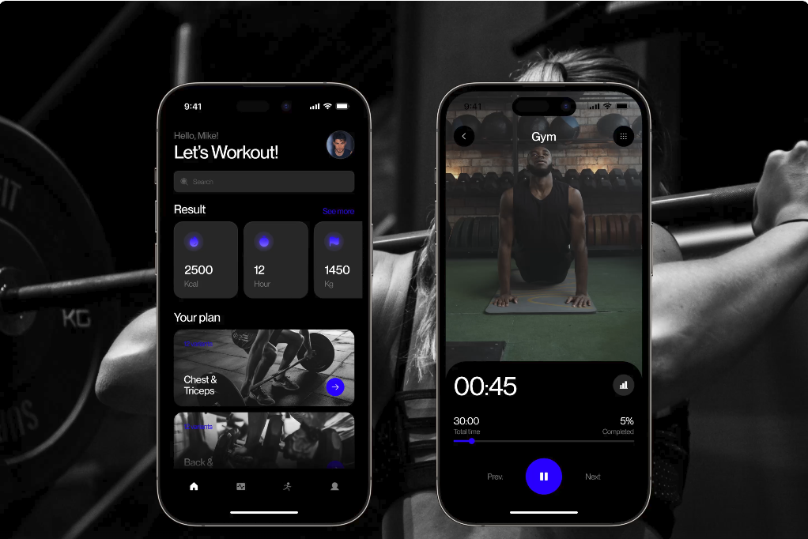
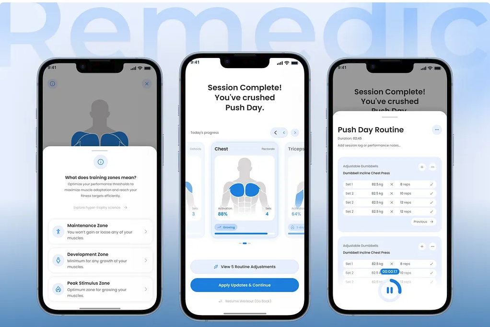
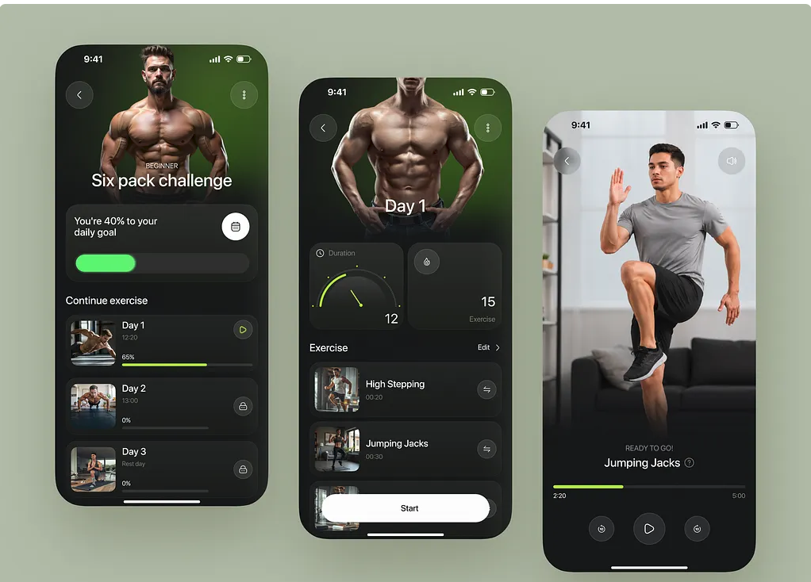

# **PROGRAMAÇÃO PARA DISPOSITIVOS MÓVEIS II**

# **PROPOSTA DO APLICATIVO**

**Disciplina:** Programação para Dispositivos Móveis II  
**Grupo:** 4  
**Integrantes:** Alêkson Castro, Gustavo Oliveira da Silva, Ítalo Emannuel Beckman, Matheus Alexandre Ferreira Nardi  
**Nome provisório do aplicativo**: Olimpus  
**Cliente / PO (se houver):** Eu

## **1\. Contexto e Problema**

Descreva brevemente o contexto em que o aplicativo será utilizado e o problema ou necessidade que ele pretende atender.

**Contexto**  
O projeto consiste no desenvolvimento de um aplicativo de saúde e fitness voltado para a gestão de treinos de musculação e monitoramento de hidratação. Atualmente, pessoas que praticam exercícios enfrentam dificuldades para manter um registro preciso da sua evolução, muitas vezes dependendo da memória ou de anotações desorganizadas em blocos de notas do celular para lembrar as cargas e séries executadas. Isso torna o acompanhamento prático ineficiente e dificulta a aplicação da sobrecarga progressiva, que é essencial para evitar a estagnação nos resultados. Além disso, a manutenção de hábitos complementares essenciais à saúde e à recuperação muscular, como a ingestão adequada de água, costuma ser negligenciada ou exige que o usuário dependa de múltiplos aplicativos dispersos (um para treino, outro para hidratação), dificultando a criação de uma rotina disciplinada. 

**Qual é o problema?**

A gestão autônoma de treinos e hábitos de saúde é fragmentada e pouco visual, dificultando:

* Lembrar com exatidão as cargas, séries e repetições executadas nos treinos anteriores;  
* Visualizar de forma clara, através de gráficos e dados, a progressão ou regressão de desempenho (saber exatamente onde está avançando ou falhando);  
* Aplicar o princípio da sobrecarga progressiva de maneira sistemática;  
* Manter o controle e a disciplina sobre a ingestão diária de água de acordo com metas individuais;  
* Centralizar a rotina de saúde (treino e hidratação) em uma interface única e de rápido preenchimento durante o exercício.

Esse problema se torna ainda mais relevante considerando que a falta de acompanhamento tátil e visual da própria evolução é uma das principais causas de estagnação, desmotivação e abandono das atividades físicas nas academias.

* **Quem possui esse problema?**

## O problema afeta principalmente:

* ## Praticantes de musculação (iniciantes a avançados) que desejam otimizar seus ganhos de hipertrofia e força de forma metódica;

* ## Pessoas que têm dificuldade em memorizar as cargas utilizadas de um treino para outro e acabam treinando abaixo do seu potencial;

* ## Indivíduos buscando construir ou manter o hábito de beber água regularmente ao longo do dia;

* ## Pessoas que se sentem desmotivadas por não conseguirem enxergar sua evolução de forma clara no espelho a curto prazo, precisando de validação em dados;

* ## Pessoas que buscam praticidade e não querem usar cadernos físicos ou múltiplos aplicativos complexos para gerenciar sua rotina de saúde.

## **2\. Público-alvo**

**Quem utilizará o aplicativo?** Praticantes de atividades físicas, especialmente musculação, de todos os níveis de experiência (iniciantes a avançados), além de indivíduos que buscam melhorar a disciplina com hábitos diários de saúde, como o consumo de água.

**Descreva brevemente os principais usuários:**

* **Usuários iniciantes:** São pessoas que começaram a frequentar a academia recentemente ou têm dificuldade em manter a constância. Eles não costumam lembrar as cargas ou os exercícios de um treino para o outro e precisam de um sistema simples e visual para registrar sua rotina. Buscam, acima de tudo, facilidade de uso, motivação através de dados visuais rápidos e ajuda para construir o hábito da hidratação.  
* **Usuários intermediários e avançados:** São praticantes assíduos de musculação que compreendem a necessidade matemática da sobrecarga progressiva (aumentar pesos ou repetições). Procuram uma ferramenta ágil, que não tome tempo de descanso durante o treino, para registrar o histórico exato do seu desempenho. Precisam de gráficos e dados precisos para evitar a estagnação muscular e otimizar os ganhos de força e hipertrofia.  
* **Usuários focados em saúde e rotina (Foco em Hábitos):** Pessoas que buscam praticidade e não querem usar múltiplos aplicativos dispersos. O interesse principal delas pode estar tanto na manutenção do peso quanto no bem-estar geral, precisando de lembretes e de uma interface única para garantir que estão batendo a meta diária de ingestão de água de forma disciplinada.

## **3\. Principais Funcionalidades**

O aplicativo será desenvolvido como uma ferramenta mobile especializada na gestão de treinos de musculação e monitoramento de hábitos de saúde (hidratação). Considerando o tempo disponível para desenvolvimento, o projeto terá como foco um MVP funcional, priorizando as funcionalidades essenciais para o registro tátil do treino, acompanhamento visual da progressão e a integração dos recursos obrigatórios da disciplina.

#### **3.1 Cadastro e autenticação de usuários**

Permitir que usuários criem uma conta e realizem login na plataforma para salvar seus dados na nuvem. **Funcionalidades:**

* Cadastro de usuário;  
* Login e logout;  
* Recuperação de acesso (caso viável no tempo disponível);  
* Configuração inicial do perfil (peso corporal, meta diária de água e nível de experiência). **Prioridade:** Alta **Etapa prevista:** Etapa 1 / Etapa 2

#### **3.2 Biblioteca de Exercícios**

Apresentar os exercícios disponíveis no aplicativo, organizados por grupos musculares, para padronizar o registro de treinos. Para otimizar o desenvolvimento e garantir uma base de dados vasta e padronizada logo no MVP, não haverá cadastro manual de exercícios. O sistema consumirá dados de datasets ou APIs de terceiros (como o [ExerciseDB](https://github.com/exercisedb/exercisedb-api%20) ou repositórios open-source como o [free-exercise-db](https://github.com/yuhonas/free-exercise-db)).  Categorias iniciais:

* Peitoral;  
* Costas;  
* Pernas (Quadríceps, Posteriores, Panturrilhas);  
* Ombros;  
* Bíceps e Tríceps;  
* Abdômen. 

O usuário poderá pesquisar e visualizar a lista de exercícios provenientes dessa integração para adicioná-los à sua rotina, aproveitando os dados já estruturados fornecidos pelo repositório (nomes padronizados, músculos alvo e possíveis mídias demonstrativas).  

**Prioridade**: Alta **Etapa prevista**: Etapa 1 

#### **3.3 Criação e Gestão de Treinos**

Permitir que o usuário monte suas rotinas de treino (ex: Treino A, B, C) de forma personalizada. **Funcionalidades previstos:**

* Criar uma nova ficha de treino;  
* Adicionar exercícios da biblioteca à ficha;  
* Definir o número alvo de séries e repetições para cada exercício. **Prioridade:** Alta **Etapa prevista:** Etapa 1 / Etapa 2

#### **3.4 Registro de Execução e Sobrecarga (O Core do App)**

A interface principal utilizada durante o exercício na academia para resolver o problema de memorização. **Informações e Ações:**

* Visualização imediata da carga e repetições executadas no **treino anterior** (lado a lado com o atual);  
* Campos rápidos para preencher: Peso (kg) e Repetições da série atual;  
* Checklist de conclusão de série. **Prioridade:** Alta **Etapa prevista:** Etapa 1

#### **3.5 Módulo de Hidratação**

Centralizar a meta de água no mesmo ambiente do treino. **Funcionalidades:**

* Barra de progresso visual (Meta diária vs. Consumido);  
* Botões de adição rápida (ex: \+250ml, \+500ml);  
* Histórico simplificado de consumo do dia. **Prioridade:** Alta **Etapa prevista:** Etapa 2

#### **3.6 Painel de Evolução (Gráficos)**

Permitir que o usuário visualize sua progressão para manter a motivação e evitar estagnação. **O usuário poderá visualizar:**

* Gráfico de linha mostrando a evolução de carga máxima em exercícios-chave (ex: Supino, Agachamento);  
* Histórico de treinos concluídos no mês (calendário). **Prioridade:** Média/Alta **Etapa prevista:** Etapa 2 ou Etapa 3

#### **3.7 Cronômetro Integrado**

Disponibilizar um temporizador de descanso entre as séries diretamente na tela de registro. O usuário não precisará sair do app para cronometrar o intervalo, mantendo o foco e evitando a dispersão em outros aplicativos. **Prioridade:** Média **Etapa prevista:** Etapa 2

#### **3.8 Cálculo de Volume Total (Volume Load)**

O aplicativo apresentará uma indicação matemática simples do esforço total do treino para validar a sobrecarga progressiva. **Exemplo:**

* Treino Anterior (Agachamento): 3 séries x 10 repetições x 50kg \= **1.500kg totais**  
* Treino Atual: 3 séries x 10 repetições x 55kg \= **1.650kg totais** (Sinalização verde de progressão). O objetivo não é ser excessivamente complexo no início, mas fornecer um dado tátil de evolução. **Prioridade:** Média **Etapa prevista:** Etapa 3

#### **3.9 Gamificação Básica (Conquistas)**

Após uma semana de treinos ou ao bater a meta de água, o usuário recebe estímulos visuais. **Funcionalidades:**

* Contador de "ofensiva" (*streak*) de dias seguidos batendo a meta de água ou comparecendo à academia. **Prioridade:** Baixa **Etapa prevista:** Etapa 4

#### **3.10 Recurso de Inteligência Artificial**

A IA será utilizada de maneira diretamente relacionada à aplicação da sobrecarga progressiva ou suporte ao usuário.

* **Possibilidade 1 (Sugestão de Carga):** Analisar o histórico de desempenho do usuário nas últimas semanas e sugerir, via IA, quando é o momento seguro para tentar aumentar o peso ou as repetições no próximo treino.  
* **Possibilidade 2 (Assistente de Treino):** Um *chatbot* integrado onde o usuário pode perguntar "Como substituir o exercício X se a máquina estiver ocupada?" e receber sugestões baseadas no mesmo grupo muscular. A escolha definitiva entre IA em nuvem (ex: consumindo uma API), IA embarcada ou outra abordagem será feita durante a Etapa 3, considerando os critérios apresentados pela disciplina (custo, desempenho, conectividade). **Prioridade:** Alta — requisito da disciplina **Etapa prevista:** Etapa 3

## **4\. Arquitetura e Padrões Técnicos (Requisitos da Disciplina)**

Para atender a todos os requisitos exigidos pela disciplina e integrar as tecnologias apresentadas pelos grupos de seminários, o aplicativo será desenvolvido com as seguintes premissas técnicas:

* **Gerenciamento de Estado (Tema do Grupo 1):** Será adotado o padrão **Provider** ou **Riverpod**, separando de forma clara a lógica de negócios e de estados da interface gráfica (UI).
* **Publicação na Play Store (Tema do Grupo 2):** O projeto será configurado desde o dia 1 visando a geração limpa do pacote de produção (`.aab`), lidando com chaves de assinatura e permissões nativas necessárias para a distribuição oficial no Google Play.
* **Consumo de APIs REST (Tema do Grupo 3):** O app fará requisições HTTP seguras (via `dio` ou `http`) para consultar a biblioteca de exercícios ou a nuvem (Supabase), aplicando as melhores práticas de chamadas assíncronas, *parsing* de JSON para objetos em Dart e tratamento global de erros de rede.
* **Arquitetura, Repository Pattern e Injeção de Dependência (Tema do Grupo 4 - Nosso Tema):** A base de código será orientada a uma arquitetura limpa dividida em camadas (Dados, Domínio e Apresentação). O **Repository Pattern** atuará abstraindo o acesso aos dados, blindando a interface da comunicação com o banco. Por fim, os recursos serão orquestrados através de **Injeção de Dependência** (com ferramentas como `get_it`), garantindo um projeto testável e escalável.

## **5\. Informações Complementares**

### **5\. Informações Complementares**

**Registre outras informações que ajudem a compreender a proposta.**

**Aplicativos ou soluções semelhantes que conhecem:**

* Focados em Treino: Strong, Hevy, FitNotes, Jefit (São excelentes para o registro de carga e cálculo de volume, mas não integram hidratação ou rotina diária, e muitas vezes possuem interfaces poluídas para iniciantes).  
* Focados em Hidratação: Water Reminder, Aqualert, Lembrete de Água (Cumprem apenas o papel de alertar sobre o consumo de líquidos, forçando o usuário a manter múltiplos aplicativos).  
* Generalistas: MyFitnessPal, Samsung Health, Apple Health (São muito amplos, com foco excessivo em contagem de calorias ou passos, falhando em entregar uma ferramenta específica e profunda para a sobrecarga progressiva na musculação).

**Ideias ou diferenciais para o aplicativo:**

* Centralização de Rotina (O Hub de Saúde): O grande diferencial é unir a principal variável de resultado na academia (esforço e sobrecarga) com a principal variável de recuperação (água) em uma única interface.  
* Registro de Baixo Atrito ("One-Tap"): Interface projetada para preenchimento ágil durante o treino, garantindo que o usuário consiga registrar a carga e repetições em poucos segundos, sem comprometer o tempo de descanso.  
* Contraste Imediato: Apresentação da carga do treino anterior lado a lado com os campos de preenchimento do treino atual, eliminando a dependência da memória.

**Possíveis recursos externos necessários (API, localização, câmera, notificações, IA etc.):**

* API de Exercícios: Consumo de banco de dados ou API REST externa (ex: ExerciseDB / free-exercise-db) para popular a biblioteca de exercícios do aplicativo de forma automatizada, poupando esforço de modelagem e inserção manual.  
* O aplicativo será desenvolvido utilizando o framework multiplataforma Flutter, garantindo agilidade na entrega de um MVP funcional tanto para Android quanto para iOS. Para o back-end e gerenciamento de banco de dados, será adotada a plataforma **Supabase** (Backend as a Service). O Supabase fornecerá de forma nativa o banco de dados (PostgreSQL), sistema de autenticação e armazenamento em nuvem, reduzindo a complexidade de infraestrutura para que o foco seja mantido no desenvolvimento mobile.
* **Notificações Push (Locais/Remotas)**: Ferramenta fundamental para disparar lembretes periódicos de hidratação ao longo do dia e alertas para o treino programado.  
* **Integração de Inteligência Artificial:** A IA será aplicada na análise de dados do histórico de treinos do usuário. Aproveitando a infraestrutura do Supabase, utilizaremos **Edge Functions** (funções serverless) para processar as métricas registradas (cargas, séries e repetições) e enviá-las para uma API de LLM (como OpenAI ou Gemini). Com base nessa análise, a IA fornecerá *insights* e sugestões personalizadas — indicando, por exemplo, o momento ideal e seguro para aumentar o peso ou apontar em quais exercícios o usuário está falhando em evoluir, auxiliando diretamente na aplicação da sobrecarga progressiva.

**Outras observações:**

**6\. Definição das entregas em cada etapa**

| Etapa | Entrega |
| :---- | :---- |
| **1** |  |
| **2** |  |
| **3** |  |
| **4** |  |

**REFERÊNCIAS DE DESIGN**

